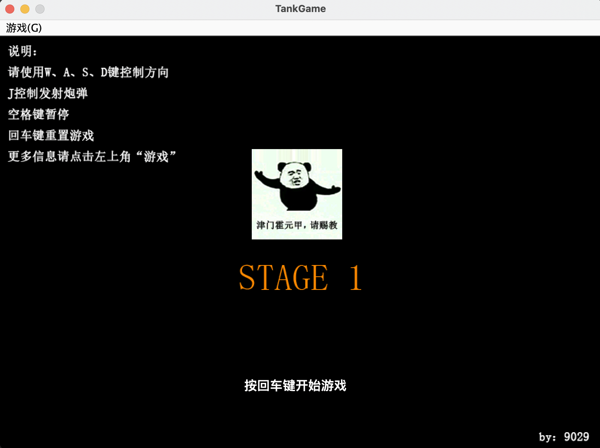
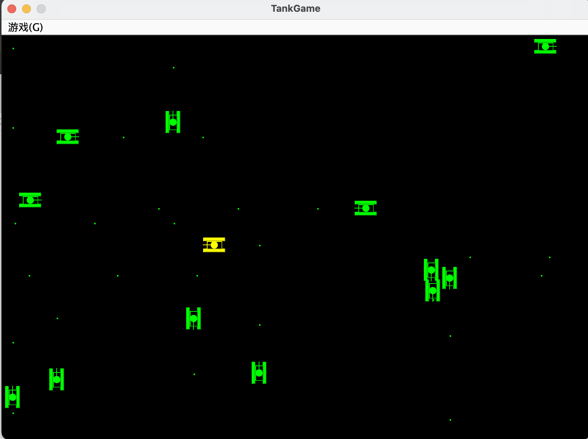
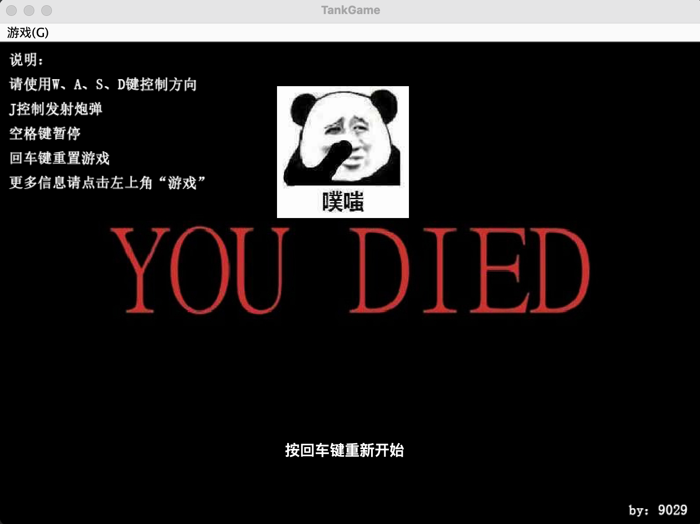
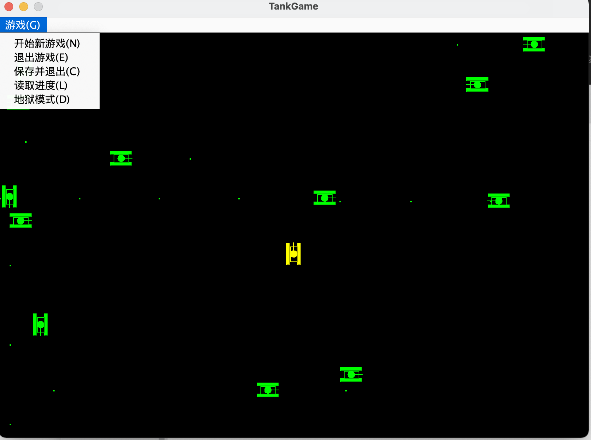
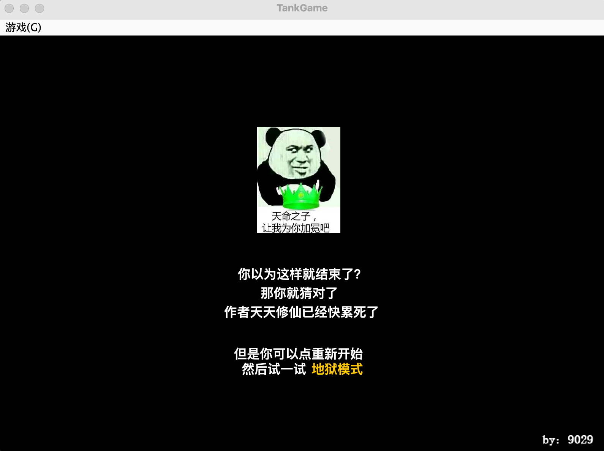

# tank_game
A tank game wrote in JAVA during the summer of 2017 (at the end of my freshman year).

------

### Quick Start

This program was written too long ago, so **the version of java should be 1.8**. It won't work if you using a heigher version. 

Be sure you are using java1.8, then you can run it in this way:
```
java -jar ./out/artifacts/tank_game_jar/tank_game.jar
```
or you can just using IDEA or other IDEs to run it.

------

### How to play
Moving: **A S D W**

Fire: **J**

Pause/Continue: **Space**

------
I learned JAVA by writing this program. Check the code, you will find the code is so hard to read, and many unprofessional code. 
I even named a variable as **aaa**, it's awful and funny, but everyone starts like this.

### Pictures









